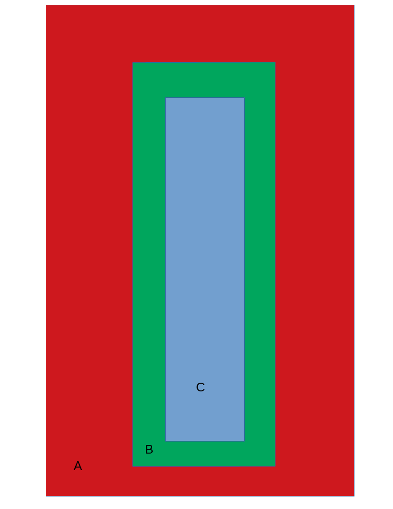

# Zone UI
## General
This test will build the following zone hierarchy:

 

The tests consist of setting different component parameters and moving through the zones.  In each zone, the component modes are changed.

## Preconditions
In an empty region of a domain with editing rights
## Test
The test images are named ExpectedImage_00001 and up.